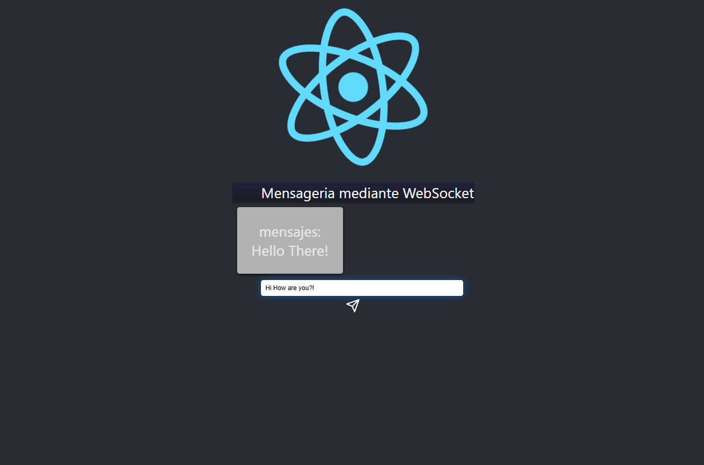

# 🚀 Abe React Learning — React WebSocket Chat

**One-liner:** Minimal Create React App demonstrating a WebSocket-based chat UI component.

## 📌 Project Summary
- **Objective:** Build a lightweight front-end demo that sends and receives messages over WebSocket and renders them in a simple chat UI.
- **Context & Challenge:** The main challenge was keeping message flow and UI state minimal while handling streamed incoming data reliably (parsing binary/text frames and appending to state).
- **Timeframe:** Prototype-level app (single-component focus; quick iteration).

## ▶ Project Overview
This repository contains a small React TypeScript app created with Create React App. The visible demo mounts a `ChatWebSocket` component that connects to a WebSocket server at `ws://localhost:8087`, sends user messages, and displays incoming messages in a simple scrollable list.

## ✅ Key Features
- Simple WebSocket client with lifecycle management
- Message input with Enter-to-send and send icon
- Minimal, responsive UI using CSS and `react-icons`
- Typed React components with TypeScript

## 🖼 Preview

- This project is intended to run locally; no hosted demo is provided.
- To see the live chat you must run a WebSocket server at `ws://localhost:8087`.

## 📁 Project Structure
- [package.json](package.json#L1-L200) — dependencies & scripts
- [src/App.tsx](src/App.tsx#L1-L200) — App entry; mounts the chat component
- [src/components/ChatWebSocket/ChatWebSocket.tsx](src/components/ChatWebSocket/ChatWebSocket.tsx#L1-L200) — WebSocket chat UI & logic
- [public/manifest.json](public/manifest.json#L1-L200) — PWA metadata and icons

## 🏛 Architecture Highlights
- Event-driven UI: WebSocket events update React state.
- Component-based: `ChatWebSocket` encapsulates connection and render logic.
- Simple observer-style message handling: incoming frames appended to local state for rendering.

## 🛠 Technology Stack
- React: Component-driven UI and state management.
- TypeScript: Static types for safer component contracts.
- WebSocket API: Real-time bidirectional messaging.
- Create React App: Tooling, build and dev server.
- react-icons: Lightweight iconography for UI affordances.

## 🧩 Code Snippet — WebSocket setup
```typescript
useEffect(() => {
	const newSocket = new WebSocket("ws://localhost:8087");
	newSocket.onmessage = (event) => {
		event.data.text().then((text: string) => {
			setMensajes((prev) => [...prev, text]);
		});
	};
	newSocket.onclose = () => console.log("disconnected");
	setSocket(newSocket);
}, []);
```

## ⚙ Code Quality & Engineering Practices
- TypeScript with explicit types for states and WebSocket references.
- Single-responsibility component: `ChatWebSocket` manages connection and rendering.
- Minimal external dependencies to keep surface area small and maintainable.
- Clear separation of UI (CSS) and logic (component hooks).

## ▶ How to build & run locally
1. Install dependencies:
```bash
npm install
```
2. Start the React dev server:
```bash
npm start
```
3. Build for production:
```bash
npm run build
```
4. WebSocket server: this project expects a server at `ws://localhost:8087`. A minimal Node server (example) can be run separately.

## 🛠 Minimal example WebSocket server (Node)
```js
// run with: node ws-server.js
const WebSocket = require('ws');
const wss = new WebSocket.Server({ port: 8087 });
wss.on('connection', (ws) => {
	ws.on('message', (msg) => {
		// echo to all
		wss.clients.forEach(c => c.readyState === WebSocket.OPEN && c.send(msg));
	});
});
```

## 🧭 Development insights / timeline
- Focused on fast iteration of a single feature: chat via WebSocket.
- Clean TypeScript integration to ensure easy extension for message parsing or richer UI.

## 🎓 Learning Outcomes
- Demonstrated practical WebSocket integration in a React + TypeScript app.
- Practiced component isolation and event-driven UI updates.
- Prepared code for incremental features (reconnect logic, message metadata).

## ✉️ Author / Contact
- Local project: `abe-react-learning` (workspace)
- No public repository URL provided.

